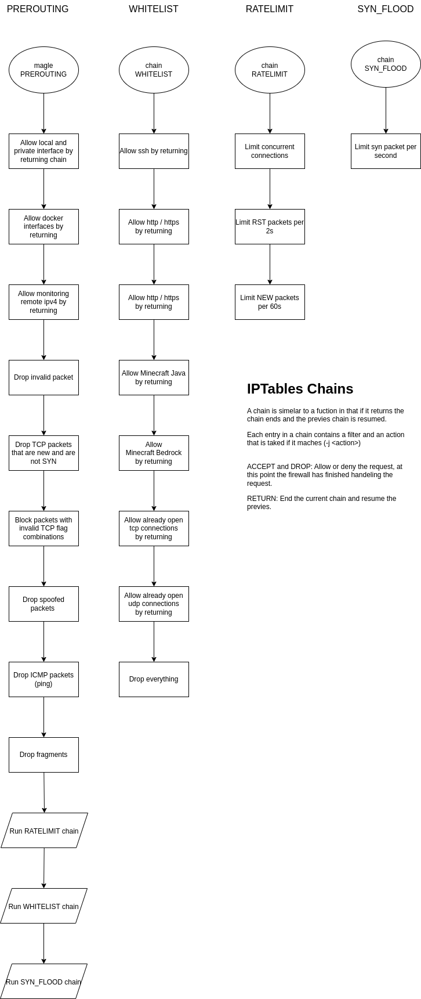
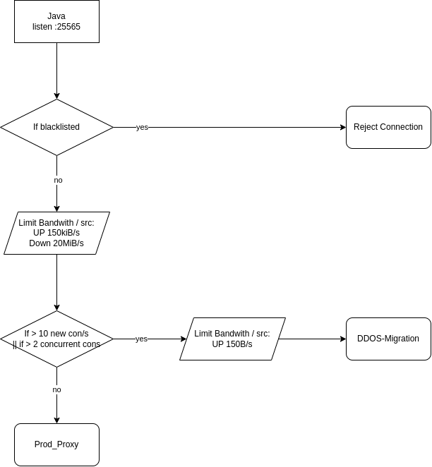

# Minecraft Firewall

This Project aims to protect Minecraft Servers from DDOS attacks.

## Table of Contents
- [Minecraft Firewall](#minecraft-firewall)
  - [Table of Contents](#table-of-contents)
  - [Features](#features)
  - [Host Firewall](#host-firewall)
  - [Application Firewall](#application-firewall)
  - [State of the Project](#state-of-the-project)
  
## Features
- Host Firewall
  - Protects the host from general threats like port scanning, syn flooding, etc.
  - Can be imported using iptables.
  - Can be made persistent using `iptables-persistent` package.
- Application Firewall
  - Protects the Minecraft Server from DDOS attacks.
  - Limits the number of connections and bandwidth per IP.
  - Can be configured using haproxy.
  - Can be used to mitigate connections to a honeypot for further analysis.

## Host Firewall

The Host Firewall is realized with iptables.
It aims to protect against more general threats like port scanning, syn flooding, etc.

The firewall can be imported using the following command:
```bash
sudo iptables-restore host_firewall.iptables
```
> **Note:** This will not be persistent after a reboot. You can use the `iptables-persistent` package to make it persistent.

> **Imported:** This will only handle ipv4 traffic. You should also configure the ipv6 firewall if you have ipv6 enabled.



See the [host_firewall.iptables](host_firewall.iptables) file for the rules.

> This firewall is based on a snippet from 
> [Maxopoly](https://github.com/Maxopoly/)
> ([snippet](https://gist.github.com/Maxopoly/6c925a1f18f9e2f3b9818d1c1582b17e)).


## Application Firewall

The Application firewall has been realized with an haproxy.
It aims to protect the Minecraft Server from DDOS attacks by limiting the number of connections the bandwidth per IP.

Currently the limits are configured in a way that 2 players can play without any issues.

If the limit is reached, connection should be mitigated to a honeypot for further analysis.
> Here is a honeypot that look promising, but it needs haproxy support: [[Minecraft-Honeypot](https://github.com/LockBlock-dev/MinePot)]



See the [application_firewall.haproxy](application_firewall.conf) file for the configuration.

> **Note:** The application firewall does not support bedrock edition yet.

## State of the Project

The project is still in development and not yet ready for production use.

The Host and Application Firewall are implemented and can be used.

Feel free to contribute to the project by creating issues or pull requests.

I hope this project can help to protect Minecraft Servers and the game more enjoyable for everyone.


